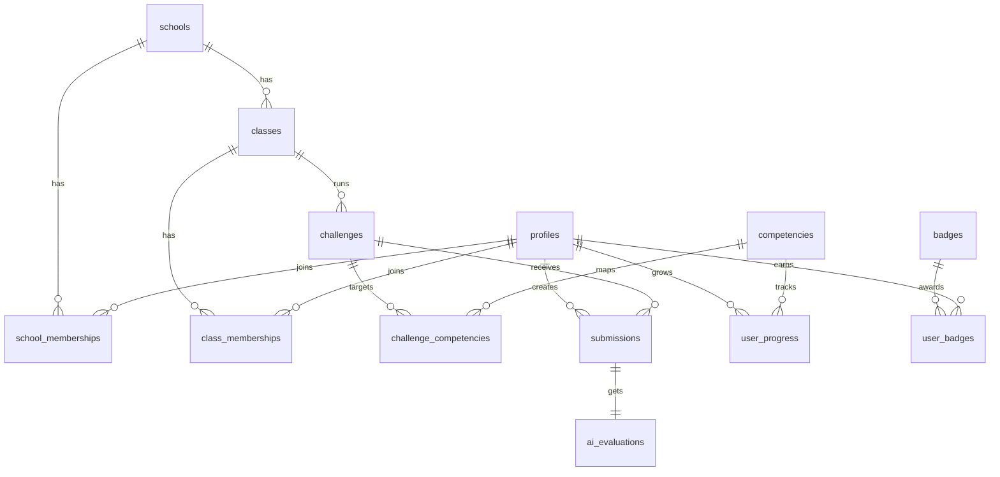
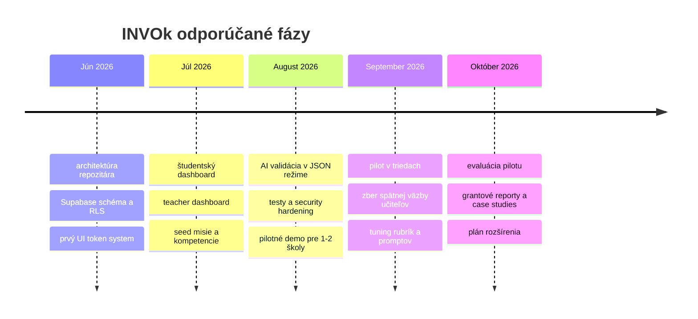

# INVOk ako produkčný skelet gamifikovanej platformy pre základné vzdelávanie

## Manažérske zhrnutie

V slovenskom prostredí je oficiálny kurikulárny dokument pre základné vzdelávanie **Štátny vzdelávací program pre základné vzdelávanie 2023**, nie český termín RVP; v tejto správe preto mapujem požadované „RVP výstupy“ na **ŠVP ZV 2023**, jeho profil absolventa, vzdelávacie štandardy a sprievodné dokumenty NIVaM. Ministerstvo uvádza, že nový ŠVP schválilo 31. 3. 2023, postupne podľa neho učí už takmer polovica základných škôl a od školského roka 2026/2027 podľa neho začnú od 1. ročníka učiť všetky základné školy. ŠVP zároveň posúva ťažisko od memorovania k funkčnej gramotnosti, kritickému prístupu k informáciám, riešeniu zložitých problémov, tvorbe a spolupráci v tímoch. citeturn15view0turn3view0

Pre platformu INVOk je preto najvhodnejší koncept **„kompetenčného herného sveta“**, v ktorom sa žiaci neučia „predmety“, ale plnia misie rozvíjajúce: komunikáciu, kritické myslenie, digitálnu bezpečnosť, podnikavosť, tímovosť, finančnú zodpovednosť, občiansku angažovanosť, environmentálne uvažovanie a sebareflexiu. Takýto model je dobre obhájiteľný aj v grante: je priamo naviazaný na nové slovenské kurikulum, podporuje merateľné výsledky, umožňuje pilotné overenie a prirodzene prepája podnikavosť s prierezovými gramotnosťami. citeturn3view0turn7view0turn10view0turn28view0turn30view0turn30view1turn29view0

Z architektonického hľadiska odporúčam **jednorepozitárový skelet** s **Vite + TypeScript + vanilla modulmi** na fronte, **Vercel Functions** pre API a server-only logiku, a **Supabase Postgres/Auth/Storage** s dôsledným **RLS**. Táto voľba je grantovo silná, lebo ostáva lacná, čitateľná a auditovateľná, pričom Vite dáva optimalizovaný build, Vercel automatické preview deploymenty z GitHubu a Supabase kombinuje Postgres, autentifikáciu a databázové politiky „defense in depth“. citeturn12search2turn22search0turn22search2turn12search1turn12search15turn12search17

AI odporúčam použiť iba ako **vysvetliteľnú formatívnu validáciu**, nie ako konečné známkovanie. Európska komisia, OECD aj UNESCO zdôrazňujú potrebu etického používania AI v škole, kritickej AI gramotnosti a zachovania učiteľského úsudku; OECD navyše pri AI v hodnotení opakovane vyzdvihuje potrebu teacher-centric dashboardov a ľudskej kontroly nad výsledkami. Preto má byť výstup AI vždy štruktúrovaný, zdôvodnený, s mierou istoty a flagom „vyžaduje učiteľské posúdenie“. citeturn37view0turn19search1turn21search3turn40view0

Z pohľadu ochrany súkromia je pre INVOk vhodný **privacy-by-design model s pseudonymizáciou**: aplikácia nemá potrebovať reálne mená detí v seedoch ani v analytike, ale len aliasy a väzby na školu/triedu. EÚ aj EDPB zdôrazňujú pseudonymizáciu, minimalizáciu dát, obmedzenie účelu, integritu a dôvernosť spracúvania; pri deťoch treba byť ešte konzervatívnejší. Prakticky to znamená: žiadne osobné e-maily detí, žiadne zbytočné PII v promptoch, žiadne verejné leaderboardy s identitou a striktne server-only použitie tajných kľúčov. citeturn13search0turn13search1turn13search3turn13search8turn13search14turn12search7turn12search13

## Súlad s kurikulom a kompetenčný model

INVOk by nemal kopírovať raw názvy zo ŠVP. Oveľa silnejšie je preložiť oficiálne výstupy do **dieťaťu zrozumiteľných „hrdinských kompetencií“**, ktoré sú zároveň ľahko merateľné v misiach, tímoch a portfóliu. Nasledujúca mapa vychádza z cieľov ŠVP, profilu absolventa, VO **Človek a svet práce**, digitálnej, mediálnej, občianskej, finančnej a sociálno-emocionálnej gramotnosti. INVOk tak nepokrýva celý ŠVP v plnej šírke, ale robí silný a grantovo uveriteľný výrez presne tam, kde sa pretínajú podnikavosť, kritické myslenie, tímovosť a digitálne prostredie. citeturn3view0turn15view0turn7view0turn8view0turn8view1turn28view0turn30view0turn30view1turn30view2turn29view0

| Kompetenčné id | Detský názov | Stručný opis | Príklad misie | Ako to merať |
|---|---|---|---|---|
| `com_story` | **Rozprávač a vyjednávač** | Vie jasne vysvetliť nápad, počúvať druhých a reagovať s rešpektom. | Pitch školského nápadu pre „žiacku radu investorov“. | Rubrika: zrozumiteľnosť, argumenty, reakcia na otázky, spolupráca. |
| `fact_detective` | **Detektív faktov** | Overuje tvrdenia, rozlišuje fakty, názory a manipuláciu. | Rozbor reklamy alebo hoaxu a návrh férovej kampane. | AI + učiteľ: počet doložených zdrojov, práca s dôkazmi, identifikácia manipulácie. |
| `logic_solver` | **Majster riešení** | Rozkladá problém, navrhuje postup a vyhodnocuje riešenie. | Návrh riešenia radu v škole: chaos v šatni, plytvanie papierom, dlhé rady v jedálni. | Kritériá: definícia problému, plán, test, reflexia výsledku. |
| `digital_nav` | **Digitálny navigátor** | Bezpečne používa digitálne nástroje, tvorí obsah a chápe riziká. | Vytvorenie digitálneho plagátu alebo mikrostránky pre školský projekt. | Rubrika: bezpečnosť, citácie zdrojov, kvalita obsahu, digitálna hygiena. |
| `maker_venture` | **Tvorca a vynálezca** | Mení nápad na jednoduchý produkt, prototyp alebo službu. | Návrh a výroba jednoduchého produktu pre školský jarmok. | Prototyp, užitočnosť, realizovateľnosť, iterácia po spätnej väzbe. |
| `team_builder` | **Staviteľ tímu** | Dohodne si roly, nesie diel zodpovednosti a rieši konflikty pokojne. | Skupinová misia s rozdelením rolí: dizajnér, hovorca, tester, rozpočtár. | Peer feedback, učiteľský záznam rolí, dodržanie termínov, tímová reflexia. |
| `resource_guard` | **Strážca zdrojov** | Rozumie hodnote peňazí, času a materiálu, neplytvá nimi. | Mini-rozpočet projektu alebo triedneho podujatia. | Rozpočet, hospodárne rozhodnutia, zdôvodnenie výdavkov, práca s limitom. |
| `civic_impact` | **Hrdina komunity** | Zapája sa do komunity, myslí eticky a chápe dopad riešení na ľudí. | Misia „Spravme školu lepšou“ s návrhom malej verejnoprospešnej zmeny. | Prínos pre komunitu, rešpekt k pravidlám, etické zdôvodnenie riešenia. |
| `planet_guard` | **Ochranca planéty** | Vníma dopady na prostredie a navrhuje udržateľnejšie riešenia. | Redizajn školského projektu tak, aby vznikalo menej odpadu. | Kritériá: odpad, materiály, opakované použitie, dopad na okolie. |
| `self_captain` | **Kapitán svojho rastu** | Pozná svoje silné stránky, pýta si spätnú väzbu a plánuje ďalší krok. | Portfólio „čo sa mi podarilo, čo zlepším, čo idem skúsiť ďalej“. | Sebareflexia, konkrétnosť cieľov, napĺňanie osobného plánu. |

Tieto kompetencie sa dajú v databáze evidovať ako **platformové kompetencie**, nie ako náhrada predmetových známok. To je dôležité aj pedagogicky: učiteľ v platforme sleduje rozvoj a projektový výkon, nie „paralelný školský klasifikačný systém“. V grante je to plus, lebo znižuje odpor škôl a zvyšuje kompatibilitu s ich ŠkVP. citeturn15view0turn27search1turn27search9

## Pedagogika, gamifikácia a engagement

Výskum je dnes pomerne konzistentný v tom, že gamifikácia vie zlepšiť **motiváciu, engagement a participáciu**, ale jej účinok nie je automatický. Najlepšie funguje tam, kde sú herné prvky priamo previazané s cieľmi učenia, spätnou väzbou, sebariadením a kvalitne štruktúrovanou spoluprácou; slabšie funguje tam, kde zostane len pri bodíkoch a odmenách. Systematické prehľady pre K–12 aj širšie vzdelávacie prostredie ukazujú rast záujmu a spravidla priaznivé výsledky, no upozorňujú aj na riziko novosti, prežívania súťaživosti a povrchovej motivácie pri zlom dizajne. OECD zároveň rámcuje gamifikáciu skôr ako súčasť „pedagogiky hry“ – učenie ako objavovanie, iteráciu a agentnosť – než ako samotný systém odmien. citeturn35search0turn35search2turn35search4turn18search2turn17search5turn18search17

Pre vek žiakov základnej školy sú kľúčové ešte tri vrstvy. Prvá je **sociálno-emocionálne učenie**: OECD a CASEL ukazujú, že sociálne a emocionálne zručnosti sú spojené s lepšími akademickými aj životnými výsledkami. Druhá je **metakognícia a sebaregulácia**: EEF dlhodobo odporúča učiť žiakov plánovať, monitorovať a vyhodnocovať vlastné učenie. Tretia je **štruktúrovaná spolupráca**: EEF upozorňuje, že kooperácia nefunguje len tým, že posadíme deti do skupín; potrebuje jasné úlohy, pravidlá a spoločný výstup. To všetko presne sedí na dizajn INVOk: misia → plán → tvorba → spätná väzba → reflexia → ďalší pokus. citeturn26search0turn26search1turn26search12turn27search1turn27search4turn27search2turn27search9

### Odporúčané herné mechaniky

| Mechanika | Pedagogický efekt | Najsilnejšie viazané kompetencie | Implikácia pre hodnotenie |
|---|---|---|---|
| **Odznaky** | Oceňujú konkrétny typ výkonu, nie iba celkové skóre. | `team_builder`, `fact_detective`, `planet_guard` | Udeľovať za jasný dôkaz správania alebo výstupu. |
| **XP a levely** | Dávajú pocit postupu a rastu v čase. | Všetky | Body viazať na kvalitu, nie iba dokončenie. |
| **Misie a questy** | Pracujú s cieľom, kontextom a problémom. | `maker_venture`, `logic_solver`, `civic_impact` | Hodnotiť priebeh aj výsledok. |
| **Okamžitá spätná väzba** | Podporuje iteráciu a metakogníciu. | `self_captain`, `digital_nav` | AI len ako prvá vrstva, učiteľ ako finálny garant. |
| **Progress bary** | Znižujú neistotu a pomáhajú plánovať kroky. | `self_captain`, `team_builder` | Meria sa plnenie checkpointov, nie iba finálny upload. |
| **Tímové odmeny** | Posilňujú spoluprácu a spoločný cieľ. | `team_builder`, `civic_impact` | Lepšie tímové achievementy než verejné individuálne rebríčky. |
| **Príbeh a maskot** | Zvyšujú zrozumiteľnosť a emočné zapojenie mladších žiakov. | všetky, najmä mladšie cykly | Nesmie nahradiť jasné kritériá výkonu. |
| **Avatar a portfólio** | Posilňujú identitu učiaceho sa a reflexiu rastu. | `self_captain`, `com_story` | Portfólio použiť ako dlhodobý dôkaz pokroku. |

Pri mladších žiakoch odporúčam **neuprednostniť verejné individuálne leaderboardy**. Lepší je model „mastery/progress first“: väčší dôraz na rast, tím a odznaky za konkrétne správanie. To je konzistentné s tým, že motivácia pri gamifikácii môže pri čisto extrinzickom dizajne časom slabnúť a že sociálno-emocionálna pohoda je samostatným kurikulárnym cieľom. citeturn35search4turn26search0turn29view0

## Architektúra, stack a štruktúra projektu

### Odporúčaný stack

Odporúčam **Vite + TypeScript + vanilla ES moduly** ako východiskový front-end. Vite dáva veľmi rýchly dev server a produkčný build s optimalizovanými statickými assetmi; TypeScript znižuje chybovosť pri práci s roľami, rubricami, JSON schémami a odpoveďami AI; a vanilla moduly držia MVP jednoduchý a lacný. Ak sa po pilote ukáže, že UI rastie do vyššej komplexity, je možné migrovať len vybrané časti na ľahký komponentový layer bez prekopania backendu. citeturn12search2turn33search0

Na serverovej strane je vhodný **Node.js vo Vercel Functions**. Vercel má natívne napojenie na GitHub, automatické preview deploymenty pre branch push/PR a verzionovanú konfiguráciu cez `vercel.json`, čo je veľmi praktické pri grantovom demo režime, kde potrebujete rýchlo ukazovať funkčné preview školám a partnerom. citeturn22search0turn22search2turn12search12turn34search0turn34search2

Pre dáta odporúčam **Supabase Postgres** s Auth, Storage a RLS. Supabase podporuje dvojvrstvový aj trojvrstvový model, auto-generované API z databázy, migrácie cez CLI a veľmi silnú databázovú autorizáciu priamo na úrovni Postgres politík. To je presne vhodné pre školský systém s rolami študent–učiteľ–admin a s požiadavkou, aby front-end nikdy nevidel tajné privilegované kľúče. citeturn12search1turn12search15turn25search0turn25search5turn25search10

### Odporúčaná štruktúra repozitára

```text
invok/
├─ api/
│  ├─ health.ts
│  ├─ auth/
│  │  └─ session.ts
│  ├─ challenges/
│  │  ├─ index.ts
│  │  └─ [id].ts
│  ├─ submissions/
│  │  ├─ index.ts
│  │  └─ [id].ts
│  └─ ai/
│     └─ validate-submission.ts
├─ backend/
│  ├─ lib/
│  │  ├─ env.ts
│  │  ├─ logger.ts
│  │  ├─ rateLimit.ts
│  │  └─ supabaseAdmin.ts
│  ├─ services/
│  │  ├─ aiValidationService.ts
│  │  ├─ challengeService.ts
│  │  └─ progressService.ts
│  ├─ validators/
│  │  ├─ submissionSchemas.ts
│  │  └─ securitySchemas.ts
│  └─ prompts/
│     └─ aiValidationPrompt.ts
├─ src/
│  ├─ app/
│  │  ├─ router.ts
│  │  └─ guards.ts
│  ├─ pages/
│  │  ├─ LoginPage.ts
│  │  ├─ StudentDashboardPage.ts
│  │  ├─ TeacherDashboardPage.ts
│  │  ├─ ChallengeDetailPage.ts
│  │  └─ PortfolioPage.ts
│  ├─ features/
│  │  ├─ quests/
│  │  ├─ competencies/
│  │  ├─ badges/
│  │  ├─ submissions/
│  │  └─ teacherReview/
│  ├─ components/
│  │  ├─ ui/
│  │  ├─ cards/
│  │  ├─ charts/
│  │  └─ mascot/
│  ├─ services/
│  │  ├─ supabaseClient.ts
│  │  ├─ apiClient.ts
│  │  └─ authClient.ts
│  ├─ state/
│  │  ├─ sessionStore.ts
│  │  └─ progressStore.ts
│  ├─ assets/
│  │  ├─ illustrations/
│  │  ├─ mascot/
│  │  ├─ icons/
│  │  └─ sounds/
│  ├─ styles/
│  │  ├─ tokens.css
│  │  └─ app.css
│  └─ main.ts
├─ public/
│  └─ favicon.svg
├─ supabase/
│  ├─ config.toml
│  ├─ migrations/
│  │  └─ 20260603_000001_init_invok.sql
│  ├─ seed.sql
│  └─ README.md
├─ docs/
│  ├─ README.md
│  ├─ ARCHITECTURE.md
│  ├─ SECURITY.md
│  ├─ AI_VALIDATION.md
│  ├─ DATABASE.md
│  └─ ROADMAP.md
├─ tests/
│  ├─ api/
│  ├─ ai/
│  ├─ db/
│  └─ security/
├─ .env.example
├─ package.json
├─ tsconfig.json
├─ vite.config.ts
├─ vercel.json
└─ .github/workflows/ci.yml
```

### Kľúčové súbory a účel

| Súbor | Účel |
|---|---|
| `api/ai/validate-submission.ts` | HTTP endpoint pre AI validáciu a teacher-review flag |
| `backend/services/aiValidationService.ts` | server-only business logika validácie |
| `backend/prompts/aiValidationPrompt.ts` | verzionovaný prompt/rubrika pre AI |
| `src/pages/StudentDashboardPage.ts` | študentský quest board, XP, odznaky, portfólio |
| `src/pages/TeacherDashboardPage.ts` | prehľad triedy, čakajúce validácie, audit AI výsledkov |
| `src/features/teacherReview/` | UI, v ktorom učiteľ potvrdí/upraví AI odporúčanie |
| `src/services/supabaseClient.ts` | browser klient iba s public/publishable kľúčom |
| `backend/lib/supabaseAdmin.ts` | server klient so secret/service kľúčom |
| `supabase/migrations/*.sql` | verzionované databázové zmeny |
| `supabase/seed.sql` | demo kompetencie, odznaky, misie |
| `docs/AI_VALIDATION.md` | pravidlá použitia AI, schéma odpovede, teacher-in-the-loop |
| `docs/SECURITY.md` | hrozby, hlavičky, upload pravidlá, GDPR minimum |
| `tests/db/` | testy schémy, RLS a integrít migrácií |
| `.github/workflows/ci.yml` | build–test–preview pipeline pri push/PR |
| `vercel.json` | bezpečnostné hlavičky, routovanie, prípadné overrides buildov |

## Dátový model, Supabase a AI validácia

### Core entity model

Nasledujúci model zachytáva to, čo INVOk reálne potrebuje v MVP: škola, trieda, roly, kompetencie, misie, odovzdania, AI evaluácia a priebežný rozvoj. Kľúčové je, že **kompetencia je samostatná entita**, nie iba tag; vďaka tomu možno robiť učiteľské dashboardy, grantové reporty aj longitudinal tracking rastu. RLS treba zapnúť na všetkých tabuľkách, ku ktorým by sa pristupovalo z front-endu. Supabase odporúča práve takýto model „least privilege + RLS + publishable key na klientovi“. citeturn12search1turn12search3turn12search7turn12search9turn12search17



### SQL migrácia

```sql
-- supabase/migrations/20260603_000001_init_invok.sql
create extension if not exists pgcrypto;

create table if not exists public.schools (
  id uuid primary key default gen_random_uuid(),
  slug text not null unique,
  name text not null,
  is_demo boolean not null default false,
  created_at timestamptz not null default now()
);

create table if not exists public.profiles (
  id uuid primary key references auth.users(id) on delete cascade,
  role text not null check (role in ('student','teacher','admin')),
  display_name text not null,
  avatar_slug text,
  mascot_slug text,
  cycle smallint check (cycle between 1 and 3),
  total_xp integer not null default 0 check (total_xp >= 0),
  current_level integer not null default 1 check (current_level >= 1),
  created_at timestamptz not null default now(),
  updated_at timestamptz not null default now()
);

create table if not exists public.school_memberships (
  id uuid primary key default gen_random_uuid(),
  school_id uuid not null references public.schools(id) on delete cascade,
  user_id uuid not null references public.profiles(id) on delete cascade,
  school_role text not null check (school_role in ('student','teacher','admin')),
  created_at timestamptz not null default now(),
  unique (school_id, user_id)
);

create table if not exists public.classes (
  id uuid primary key default gen_random_uuid(),
  school_id uuid not null references public.schools(id) on delete cascade,
  code text not null,
  title text not null,
  cycle smallint not null check (cycle between 1 and 3),
  teacher_owner_id uuid references public.profiles(id) on delete set null,
  created_at timestamptz not null default now(),
  unique (school_id, code)
);

create table if not exists public.class_memberships (
  id uuid primary key default gen_random_uuid(),
  class_id uuid not null references public.classes(id) on delete cascade,
  user_id uuid not null references public.profiles(id) on delete cascade,
  class_role text not null check (class_role in ('student','teacher','assistant')),
  created_at timestamptz not null default now(),
  unique (class_id, user_id)
);

create table if not exists public.competencies (
  id text primary key,
  name text not null,
  description text not null,
  category text not null,
  cycle_min smallint not null default 1 check (cycle_min between 1 and 3),
  cycle_max smallint not null default 3 check (cycle_max between 1 and 3),
  measurement_hint text,
  is_active boolean not null default true,
  sort_order integer not null default 100
);

create table if not exists public.challenges (
  id uuid primary key default gen_random_uuid(),
  school_id uuid references public.schools(id) on delete cascade,
  class_id uuid references public.classes(id) on delete set null,
  created_by uuid references public.profiles(id) on delete set null,
  title text not null,
  summary text not null,
  story_text text,
  challenge_type text not null default 'quest'
    check (challenge_type in ('quest','mission','challenge')),
  difficulty smallint not null default 1 check (difficulty between 1 and 5),
  base_xp integer not null default 50 check (base_xp >= 0),
  team_allowed boolean not null default false,
  evidence_required jsonb not null default '[]'::jsonb,
  rubric jsonb not null default '{}'::jsonb,
  is_published boolean not null default false,
  starts_at timestamptz,
  ends_at timestamptz,
  created_at timestamptz not null default now()
);

create table if not exists public.challenge_competencies (
  challenge_id uuid not null references public.challenges(id) on delete cascade,
  competency_id text not null references public.competencies(id) on delete cascade,
  weight numeric(5,2) not null default 1.0 check (weight > 0),
  primary key (challenge_id, competency_id)
);

create table if not exists public.submissions (
  id uuid primary key default gen_random_uuid(),
  challenge_id uuid not null references public.challenges(id) on delete cascade,
  student_id uuid not null references public.profiles(id) on delete cascade,
  class_id uuid not null references public.classes(id) on delete cascade,
  status text not null default 'draft'
    check (status in ('draft','submitted','needs_review','approved','rejected')),
  title text,
  response_text text,
  evidence jsonb not null default '[]'::jsonb,
  team_label text,
  submitted_at timestamptz,
  created_at timestamptz not null default now(),
  updated_at timestamptz not null default now(),
  unique (challenge_id, student_id)
);

create table if not exists public.ai_evaluations (
  id uuid primary key default gen_random_uuid(),
  submission_id uuid not null unique references public.submissions(id) on delete cascade,
  model_name text not null,
  prompt_version text not null,
  valid boolean,
  score integer check (score between 0 and 100),
  confidence numeric(5,2) check (confidence between 0 and 1),
  reasons jsonb not null default '[]'::jsonb,
  detected_competencies jsonb not null default '[]'::jsonb,
  suggested_teacher_review boolean not null default true,
  raw_output jsonb not null default '{}'::jsonb,
  created_at timestamptz not null default now()
);

create table if not exists public.badges (
  id text primary key,
  name text not null,
  description text not null,
  icon_slug text not null,
  criteria jsonb not null default '{}'::jsonb,
  xp_bonus integer not null default 0 check (xp_bonus >= 0),
  is_active boolean not null default true
);

create table if not exists public.user_badges (
  id uuid primary key default gen_random_uuid(),
  badge_id text not null references public.badges(id) on delete cascade,
  user_id uuid not null references public.profiles(id) on delete cascade,
  reason text,
  awarded_at timestamptz not null default now(),
  unique (badge_id, user_id)
);

create table if not exists public.user_progress (
  id uuid primary key default gen_random_uuid(),
  user_id uuid not null references public.profiles(id) on delete cascade,
  competency_id text not null references public.competencies(id) on delete cascade,
  xp integer not null default 0 check (xp >= 0),
  level integer not null default 1 check (level >= 1),
  quests_completed integer not null default 0 check (quests_completed >= 0),
  evidence_count integer not null default 0 check (evidence_count >= 0),
  last_submission_id uuid references public.submissions(id) on delete set null,
  updated_at timestamptz not null default now(),
  unique (user_id, competency_id)
);

create index if not exists idx_classes_school_id on public.classes(school_id);
create index if not exists idx_class_memberships_class_id on public.class_memberships(class_id);
create index if not exists idx_submissions_student_id on public.submissions(student_id);
create index if not exists idx_submissions_challenge_id on public.submissions(challenge_id);
create index if not exists idx_user_progress_user_id on public.user_progress(user_id);

create or replace function public.handle_new_user()
returns trigger
language plpgsql
security definer
set search_path = public
as $$
begin
  insert into public.profiles (id, role, display_name)
  values (
    new.id,
    coalesce(new.raw_user_meta_data->>'role', 'student'),
    coalesce(new.raw_user_meta_data->>'display_name', 'Hrac-' || substr(new.id::text, 1, 8))
  )
  on conflict (id) do nothing;
  return new;
end;
$$;

drop trigger if exists on_auth_user_created on auth.users;
create trigger on_auth_user_created
after insert on auth.users
for each row execute procedure public.handle_new_user();

alter table public.schools enable row level security;
alter table public.profiles enable row level security;
alter table public.school_memberships enable row level security;
alter table public.classes enable row level security;
alter table public.class_memberships enable row level security;
alter table public.competencies enable row level security;
alter table public.challenges enable row level security;
alter table public.challenge_competencies enable row level security;
alter table public.submissions enable row level security;
alter table public.ai_evaluations enable row level security;
alter table public.badges enable row level security;
alter table public.user_badges enable row level security;
alter table public.user_progress enable row level security;
```

Táto migrácia sleduje odporúčaný Supabase workflow „migrations in repo + local reset + seed“, ako aj odporúčaný vzor oddelenia `auth.users` od vlastnej tabuľky `public.profiles`. citeturn25search0turn25search2turn25search3turn25search5

### Príklady RLS politík

```sql
-- pomocné funkcie
create or replace function public.is_class_staff(_class_id uuid)
returns boolean
language sql
stable
as $$
  select exists (
    select 1
    from public.class_memberships cm
    where cm.class_id = _class_id
      and cm.user_id = auth.uid()
      and cm.class_role in ('teacher', 'assistant')
  );
$$;

create or replace function public.is_school_admin(_school_id uuid)
returns boolean
language sql
stable
as $$
  select exists (
    select 1
    from public.school_memberships sm
    where sm.school_id = _school_id
      and sm.user_id = auth.uid()
      and sm.school_role = 'admin'
  );
$$;

-- competencies: čítať môže každý prihlásený
drop policy if exists competencies_select_authenticated on public.competencies;
create policy competencies_select_authenticated
on public.competencies
for select
to authenticated
using (is_active = true);

-- submissions: žiak vidí len svoje
drop policy if exists submissions_select_own on public.submissions;
create policy submissions_select_own
on public.submissions
for select
to authenticated
using (student_id = auth.uid());

-- submissions: žiak môže vložiť len svoje odovzdanie
drop policy if exists submissions_insert_own on public.submissions;
create policy submissions_insert_own
on public.submissions
for insert
to authenticated
with check (student_id = auth.uid());

-- submissions: učiteľ vidí odovzdania svojej triedy
drop policy if exists submissions_select_class_staff on public.submissions;
create policy submissions_select_class_staff
on public.submissions
for select
to authenticated
using (public.is_class_staff(class_id));

-- user_progress: žiak vidí len svoj progres
drop policy if exists user_progress_select_own on public.user_progress;
create policy user_progress_select_own
on public.user_progress
for select
to authenticated
using (user_id = auth.uid());

-- user_progress: učiteľ vidí progres žiakov zo svojej triedy
drop policy if exists user_progress_select_class_staff on public.user_progress;
create policy user_progress_select_class_staff
on public.user_progress
for select
to authenticated
using (
  exists (
    select 1
    from public.class_memberships target_cm
    join public.class_memberships my_cm
      on my_cm.class_id = target_cm.class_id
    where target_cm.user_id = user_progress.user_id
      and my_cm.user_id = auth.uid()
      and my_cm.class_role in ('teacher', 'assistant')
  )
);

-- ai_evaluations: čítať môže žiak na svojom submissione a príslušný učiteľ
drop policy if exists ai_evals_select_related on public.ai_evaluations;
create policy ai_evals_select_related
on public.ai_evaluations
for select
to authenticated
using (
  exists (
    select 1
    from public.submissions s
    where s.id = ai_evaluations.submission_id
      and (
        s.student_id = auth.uid()
        or public.is_class_staff(s.class_id)
      )
  )
);
```

`service_role` v Supabase obchádza RLS, preto nesmie ísť do prehliadača; má žiť iba v serverless/edge/server prostredí. V aktuálnej dokumentácii Supabase sa dokonca odporúča pre novšie projekty prechod k publishable/secret kľúčom, no princíp zostáva rovnaký: **public key na klienta, secret/service key výhradne na server**. citeturn12search3turn12search7turn12search13turn12search17

### Seed dáta

```sql
-- supabase/seed.sql

insert into public.competencies (id, name, description, category, cycle_min, cycle_max, measurement_hint, sort_order)
values
  ('com_story', 'Rozprávač a vyjednávač', 'Jasne vysvetlí nápad, počúva a reaguje s rešpektom.', 'communication', 1, 3, 'pitch, dialóg, prezentácia', 10),
  ('fact_detective', 'Detektív faktov', 'Overuje tvrdenia, rozlišuje fakty, názory a manipuláciu.', 'critical-thinking', 1, 3, 'zdroje, dôkazy, argumentácia', 20),
  ('logic_solver', 'Majster riešení', 'Rozloží problém na kroky a vyhodnotí riešenie.', 'problem-solving', 1, 3, 'plán, test, reflexia', 30),
  ('digital_nav', 'Digitálny navigátor', 'Bezpečne a tvorivo používa digitálne nástroje.', 'digital', 1, 3, 'obsah, bezpečnosť, citácie', 40),
  ('maker_venture', 'Tvorca a vynálezca', 'Mení nápad na prototyp alebo službu.', 'entrepreneurship', 1, 3, 'prototyp, iterácia, užitočnosť', 50),
  ('team_builder', 'Staviteľ tímu', 'Dohodne si roly, spolupracuje a nesie zodpovednosť.', 'collaboration', 1, 3, 'roly, peer feedback, termíny', 60),
  ('resource_guard', 'Strážca zdrojov', 'Rozumie hodnote peňazí, času a materiálu.', 'financial', 1, 3, 'rozpočet, hospodárenie', 70),
  ('civic_impact', 'Hrdina komunity', 'Vníma dopad riešení na ľudí a komunitu.', 'civic', 1, 3, 'prínos, etika, participácia', 80),
  ('planet_guard', 'Ochranca planéty', 'Navrhuje udržateľnejšie rozhodnutia.', 'environment', 1, 3, 'odpad, materiály, dopad', 90),
  ('self_captain', 'Kapitán svojho rastu', 'Pozná silné stránky a plánuje ďalší krok.', 'self-management', 1, 3, 'sebareflexia, osobný plán', 100)
on conflict (id) do update
set
  name = excluded.name,
  description = excluded.description,
  category = excluded.category,
  measurement_hint = excluded.measurement_hint,
  sort_order = excluded.sort_order;

insert into public.badges (id, name, description, icon_slug, criteria, xp_bonus)
values
  ('badge_first_quest', 'Prvá misia', 'Za prvé úspešne odovzdané riešenie.', 'rocket-star', '{"completed_quests":1}', 25),
  ('badge_team_player', 'Tímový parťák', 'Za konštruktívnu spoluprácu v skupine.', 'team-heart', '{"teamwork_score_min":80}', 40),
  ('badge_fact_guard', 'Strážca faktov', 'Za overovanie zdrojov a prácu s dôkazmi.', 'shield-check', '{"fact_detection_score_min":85}', 50)
on conflict (id) do update
set
  name = excluded.name,
  description = excluded.description,
  icon_slug = excluded.icon_slug,
  criteria = excluded.criteria,
  xp_bonus = excluded.xp_bonus;

insert into public.challenges
  (title, summary, story_text, challenge_type, difficulty, base_xp, team_allowed, evidence_required, rubric, is_published)
values
  (
    'Misia Menej odpadu',
    'Navrhni spôsob, ako znížiť odpad v triede alebo škole.',
    'Maskot školy prosí tím hrdinov, aby zachránili školské zdroje.',
    'quest',
    2,
    80,
    true,
    '["photo","short_text","reflection"]'::jsonb,
    '{"criteria":["jasne pomenovaný problém","navrhnuté riešenie","dopad na prostredie","tímová reflexia"]}'::jsonb,
    true
  ),
  (
    'Misia Férová reklama',
    'Analyzuj reklamu a navrhni férovejšiu verziu bez manipulácie.',
    'Staň sa detektívom faktov a ochráncom spolužiakov pred trikmi.',
    'quest',
    3,
    90,
    false,
    '["image","analysis_text"]'::jsonb,
    '{"criteria":["rozpoznanie manipulácie","dôkazy","nový návrh kampane","etické zdôvodnenie"]}'::jsonb,
    true
  ),
  (
    'Misia Mini trh',
    'Vytvor jednoduchý nápad na produkt alebo službu pre školské podujatie.',
    'Školský jarmok sa blíži a tvoj tím má priniesť užitočný nápad.',
    'mission',
    4,
    120,
    true,
    '["prototype_photo","budget","pitch_video_or_text"]'::jsonb,
    '{"criteria":["užitočnosť","realizovateľnosť","rozpočet","pitch","spolupráca"]}'::jsonb,
    true
  )
on conflict do nothing;
```

### Kostra AI validačnej služby

AI v INVOk má robiť štyri veci: skontrolovať, či je odovzdanie relevantné k misii; vypočítať transparentné skóre podľa rubriky; identifikovať pravdepodobne rozvíjané kompetencie; a priznať neistotu. Na to je vhodný **štruktúrovaný JSON výstup**, ktorý Claude podľa oficiálnej dokumentácie vie generovať cez `output_config.format` s JSON schémou. citeturn38view0turn39view1turn39view2

```js
// backend/services/aiValidationService.ts
import Anthropic from '@anthropic-ai/sdk';

const anthropic = process.env.ANTHROPIC_API_KEY
  ? new Anthropic({ apiKey: process.env.ANTHROPIC_API_KEY })
  : null;

export const evaluationSchema = {
  type: 'object',
  additionalProperties: false,
  required: [
    'valid',
    'score',
    'confidence',
    'reasons',
    'detected_competencies',
    'suggestedTeacherReview'
  ],
  properties: {
    valid: { type: 'boolean' },
    score: { type: 'integer' },
    confidence: { type: 'number' },
    reasons: {
      type: 'array',
      items: {
        type: 'object',
        additionalProperties: false,
        required: ['criterion', 'result', 'explanation'],
        properties: {
          criterion: { type: 'string' },
          result: { type: 'string', enum: ['met', 'partially_met', 'not_met'] },
          explanation: { type: 'string' }
        }
      }
    },
    detected_competencies: {
      type: 'array',
      items: {
        type: 'object',
        additionalProperties: false,
        required: ['id', 'strength', 'evidence'],
        properties: {
          id: { type: 'string' },
          strength: { type: 'number' },
          evidence: { type: 'string' }
        }
      }
    },
    suggestedTeacherReview: { type: 'boolean' }
  }
};

export async function validateSubmission({
  submission,
  challenge,
  competencies,
  promptVersion = 'v1'
}) {
  if (!anthropic) {
    return {
      valid: false,
      score: 0,
      confidence: 0,
      reasons: [
        {
          criterion: 'system',
          result: 'not_met',
          explanation: 'AI provider nie je nakonfigurovaný.'
        }
      ],
      detected_competencies: [],
      suggestedTeacherReview: true,
      meta: { promptVersion, fallback: true }
    };
  }

  const prompt = buildEvaluationPrompt({ submission, challenge, competencies });

  const response = await anthropic.messages.create({
    model: process.env.AI_VALIDATION_MODEL || 'claude-sonnet-4-5',
    max_tokens: 1200,
    messages: [{ role: 'user', content: prompt }],
    output_config: {
      format: {
        type: 'json_schema',
        schema: evaluationSchema
      }
    }
  });

  const text = response.content?.[0]?.text ?? '{}';
  const parsed = JSON.parse(text);

  const needsTeacherReview =
    parsed.suggestedTeacherReview ||
    parsed.confidence < 0.7 ||
    parsed.score < 50;

  return {
    ...parsed,
    suggestedTeacherReview: needsTeacherReview,
    meta: { promptVersion, provider: 'anthropic' }
  };
}

function buildEvaluationPrompt({ submission, challenge, competencies }) {
  return `
Vyhodnoť žiacke odovzdanie transparentne a prísne podľa misie a rubriky.

MISIA:
${JSON.stringify(challenge, null, 2)}

KOMPETENCIE:
${JSON.stringify(competencies, null, 2)}

ODOVZDANIE:
${JSON.stringify(submission, null, 2)}

PRAVIDLÁ:
1. Nepredpokladaj dôkazy, ktoré v odovzdaní nie sú.
2. Ak je dôkaz slabý alebo nejasný, zniž confidence.
3. Ak je aspoň jedno zásadné kritérium nejasné, nastav suggestedTeacherReview=true.
4. Score je 0-100.
5. Dôvody majú byť zrozumiteľné pre učiteľa aj žiaka.
6. Detected competencies uvádzaj iba vtedy, ak máš konkrétny dôkaz v odovzdaní.
`;
}
```

### Prompt template pre Claude

```text
SYSTEM
Si AI validátor školskej platformy INVOk pre základné vzdelávanie.
Tvojou úlohou nie je udeľovať definitívne známky, ale vytvoriť
transparentné odporúčanie pre učiteľa.

ZÁSADY
- Hodnoť iba to, čo je preukázané v odovzdaní.
- Pri neistote buď konzervatívny.
- Nepoužívaj psychologické ani osobnostné súdy o dieťati.
- Nepoužívaj žiadne citlivé údaje, ak nie sú nutné pre rubriku.
- Výstup musí byť valid JSON podľa schémy.
- Ak je riziko omylu, nastav suggestedTeacherReview=true.

RUBRIKA SKÓROVANIA
- relevantnosť k zadaniu: 0–25
- kvalita riešenia / realizovateľnosť: 0–25
- dôkazy a argumentácia: 0–20
- spolupráca / priebeh: 0–15
- reflexia a ďalší krok: 0–15

USER
[Misia]
...
[Kompetencie cieľové]
...
[Odovzdanie]
...
[Typ dôkazov: text / screenshot / foto / pdf]
...

POŽADOVANÝ VÝSTUP
{
  "valid": true|false,
  "score": 0-100,
  "confidence": 0-1,
  "reasons": [
    {
      "criterion": "relevantnost",
      "result": "met|partially_met|not_met",
      "explanation": "..."
    }
  ],
  "detected_competencies": [
    {
      "id": "maker_venture",
      "strength": 0-1,
      "evidence": "..."
    }
  ],
  "suggestedTeacherReview": true|false
}
```

Pedagogicky odporúčam pravidlo: **AI môže odporučiť, učiteľ rozhodne**. To je v súlade s európskymi etickými usmerneniami, UNESCO aj OECD. citeturn37view0turn19search1turn40view0

### Príklad JSON profilu žiaka

```json
{
  "userId": "0f5a3e51-2f7b-4233-a3e1-6f5590d8b7a5",
  "displayName": "Liska-07",
  "role": "student",
  "avatar": {
    "mascot": "fox",
    "colorTheme": "sky"
  },
  "totals": {
    "xp": 340,
    "level": 4
  },
  "progress": [
    {
      "competencyId": "team_builder",
      "xp": 95,
      "level": 2,
      "questsCompleted": 2
    },
    {
      "competencyId": "fact_detective",
      "xp": 80,
      "level": 2,
      "questsCompleted": 1
    },
    {
      "competencyId": "maker_venture",
      "xp": 120,
      "level": 3,
      "questsCompleted": 2
    }
  ],
  "badges": [
    { "id": "badge_first_quest", "awardedAt": "2026-09-20T10:30:00Z" },
    { "id": "badge_team_player", "awardedAt": "2026-10-04T09:20:00Z" }
  ],
  "recentSubmissions": [
    {
      "challengeTitle": "Misia Menej odpadu",
      "status": "approved",
      "score": 83,
      "teacherReviewed": true
    },
    {
      "challengeTitle": "Misia Férová reklama",
      "status": "needs_review",
      "score": 71,
      "teacherReviewed": false
    }
  ],
  "teamRewards": {
    "teamLabel": "ZeleniVynalezci",
    "teamXp": 180,
    "sharedBadgeIds": ["eco-squad"]
  }
}
```

## UX, bezpečnosť, testy a dokumentácia

### UX a vizuálny smer

Pre mladších žiakov odporúčam rozhranie s **veľkými kartami, krátkymi inštrukciami, jednoznačnými CTA, nízkym textovým šumom a silným vizuálnym rytmom**. WCAG 2.2 ostáva základom pre kontrast, fokus, navigáciu a použiteľnosť; výskum UX pre deti zároveň upozorňuje, že deti potrebujú explicitné ciele, malé kroky a iné mentálne modely než dospelí. UNICEF pri digitálnych produktoch pre deti zdôrazňuje inklúziu, reprezentáciu rôznych detí a podporu kreativity, opakovania a bezpečného experimentovania. citeturn14search0turn14search3turn14search4turn14search8

Odporúčaná paleta pre MVP:

| Použitie | Farba | Hex |
|---|---|---|
| primárna akcentová | Nebeská modrá | `#5BC0EB` |
| sekundárna pozitívna | Mäta | `#8BD3C7` |
| odmena / CTA | Slnečná žltá | `#FFD166` |
| upozornenie / review | Malinová | `#EF476F` |
| text / kontrast | Tmavá bridlica | `#2D3142` |
| neutrálne pozadie | Teplá biela | `#F7F9FC` |

Prakticky by som navrhol tri základné wireframy. **Študentský dashboard**: hore XP, level a maskot; pod tým aktívne misie; nižšie odznaky a posledné reflexie. **Detail misie**: príbeh, zadanie, checklist dôkazov, rubrika „na čo si dať pozor“, upload dôkazov, tlačidlo odovzdať. **Učiteľský dashboard**: front čakajúcich odovzdaní, AI confidence, flag teacher review, filter podľa triedy a kompetencie, klik na detail s dôkazmi a možnosťou potvrdiť/upraviť. Ako rýchlu vizuálnu inšpiráciu sa dá použiť všeobecný tag `dashboard` na CodePene a jednoduché card-based mascot rozhrania, ale pre grant je dôležitejšie, aby finálny dizajn bol **autorsky konzistentný** a pedagogicky čitateľný, nie iba „pekne animovaný“. citeturn23search0turn23search2

Pri generovaní prvého UI scaffoldingu do Claude by som pridal explicitnú požiadavku: **„vytvor aj jednoduché inline SVG mockupy maskota, quest karty a badge ikon“**. Tak sa dá hneď od začiatku testovať vizuálny tón bez závislosti na externých assetoch.

### Bezpečnosť, súkromie a `.env.example`

Vite exponuje klientovi iba premenné s prefixom `VITE_`, preto tam nesmú byť žiadne tajomstvá. Vercel umožňuje branch-specific envy a citlivé premenné, `vercel.json` zas vie niesť bezpečnostné hlavičky. Supabase explicitne uvádza, že service/secret key patrí iba do serverového prostredia. OWASP odporúča CSP, anti-clickjacking ochranu a veľmi konzervatívny upload režim. citeturn33search0turn33search6turn12search0turn12search8turn34search0turn34search1turn24search0turn24search2turn24search4turn24search12

| Premenná | Kde sa používa | Poznámka |
|---|---|---|
| `VITE_APP_ENV` | front-end | `local` / `preview` / `production` |
| `VITE_PUBLIC_BASE_URL` | front-end | verejná URL appky |
| `VITE_SUPABASE_URL` | front-end | safe na klientovi |
| `VITE_SUPABASE_PUBLISHABLE_KEY` | front-end | preferované nové pomenovanie |
| `VITE_SUPABASE_ANON_KEY` | front-end | iba ak ostávate na legacy názvosloví |
| `SUPABASE_SECRET_KEY` | server | nikdy nie do klienta |
| `SUPABASE_SERVICE_ROLE_KEY` | server | legacy názov, server-only |
| `ANTHROPIC_API_KEY` | server | AI validácia |
| `AI_VALIDATION_MODEL` | server | napr. `claude-sonnet-4-5` |
| `MAX_UPLOAD_MB` | server | odporúčam 5–8 MB |
| `ALLOWED_UPLOAD_MIME` | server | whitelist, napr. PNG/JPEG/PDF |
| `RATE_LIMIT_WINDOW_MS` | server | základný abuse control |
| `RATE_LIMIT_MAX` | server | limit requestov |
| `LOG_LEVEL` | server | `info`/`warn`/`error` |
| `SENTRY_DSN` | client/server | voliteľne error monitoring |

Odporúčaný **pseudonymizačný model**: žiak v appke vystupuje ako `Liska-07`, `Rys-12` a podobne; väzba na reálnu identitu zostáva mimo appky, v škole alebo v pedagogickom systéme, ktorý škola už vlastní. V seed dátach nemajú byť žiadne reálne osoby. Ak by pilot potreboval export výsledkov späť do školy, urobte to cez samostatný admin-only bridge s minimálnym rozsahom dát. Z hľadiska GDPR je dôležité držať sa zásad minimalizácie, obmedzenia účelu, integrity a dôvernosti. citeturn13search0turn13search3turn13search14

**Uploady dôkazov** by mali ísť do súkromného bucketu, s whitelistom typov, limitom veľkosti, kontrolou MIME + extension, ideálne s premenovaním súboru na náhodný identifikátor a s odmietnutím executable alebo neštandardných formátov. Pri fotkách treba mať pravidlo, že sa nemajú nahrávať tváre, mená na nástenkách ani iné PII, ak to nie je explicitne súčasť úlohy a právneho rámca pilotu. citeturn24search2turn24search5turn13search11

**Minimálne hlavičky** pre `vercel.json`:

```json
{
  "headers": [
    {
      "source": "/(.*)",
      "headers": [
        { "key": "Content-Security-Policy", "value": "default-src 'self'; img-src 'self' data: https:; style-src 'self' 'unsafe-inline'; script-src 'self'; connect-src 'self' https://*.supabase.co; frame-ancestors 'none'; base-uri 'self'; form-action 'self'" },
        { "key": "Referrer-Policy", "value": "strict-origin-when-cross-origin" },
        { "key": "X-Content-Type-Options", "value": "nosniff" },
        { "key": "Strict-Transport-Security", "value": "max-age=31536000; includeSubDomains; preload" },
        { "key": "Permissions-Policy", "value": "camera=(), microphone=(), geolocation=()" }
      ]
    }
  ]
}
```

Na CSP odporúčam začať v režime `Report-Only`, kým sa ustáli zoznam assetov a domén. citeturn34search1turn24search4turn24search12

### Testy a CI

Pre MVP stačí sada testov, ktorá kryje tie riziká, ktoré grantový pilot naozaj potrebuje vedieť obhájiť:

| Test | Čo overuje |
|---|---|
| `tests/db/schema.test.ts` | že migrácie vytvoria očakávané tabuľky, indexy a constraints |
| `tests/db/rls.test.ts` | že študent nevidí cudzie dáta a učiteľ vidí iba svoju triedu |
| `tests/ai/aiValidationService.test.ts` | mockovaný AI JSON výstup, teacher-review flag, fallback bez API key |
| `tests/security/envLeak.test.ts` | že `VITE_*` neobsahujú tajomstvá |
| `tests/security/uploadRules.test.ts` | whitelist MIME, limit veľkosti, odmietnutie neplatných typov |
| `tests/api/headers.test.ts` | prítomnosť CSP, HSTS, nosniff, permissions policy |

Príklad skriptov:

```json
{
  "scripts": {
    "dev": "vite",
    "build": "vite build",
    "preview": "vite preview",
    "test": "npm run test:db && npm run test:ai && npm run test:security",
    "test:db": "vitest run tests/db",
    "test:ai": "vitest run tests/ai",
    "test:security": "vitest run tests/security",
    "lint": "eslint .",
    "supabase:start": "supabase start",
    "supabase:reset": "supabase db reset"
  }
}
```

GitHub Actions má robiť iba to podstatné: `npm ci`, `lint`, `test`, `build`. Ak prejde CI, Vercel cez Git integráciu automaticky pripraví preview deployment pre PR/branch a production deployment pre main. To je silný a jednoduchý model pre tím, ktorý chce rýchlo iterovať bez vlastnej infra správy. citeturn22search1turn22search7turn22search12turn22search14

### Dokumentácia a checklist výstupov

| Dokument | Čo má obsahovať |
|---|---|
| `README.md` | rýchly štart, stack, skripty, deploy flow, základné role |
| `ARCHITECTURE.md` | diagramy, rozhodnutia stacku, data flow, teacher-in-the-loop |
| `SECURITY.md` | threat model, env rules, upload policy, RLS zásady, GDPR minimum |
| `AI_VALIDATION.md` | prompt verzie, schéma AI výstupu, teacher override, known failure modes |
| `DATABASE.md` | ER diagram, tabuľky, seedy, migrácie, policy model |
| `ROADMAP.md` | MVP, pilot, škálovanie, open questions |
| `supabase/README.md` | lokálny vývoj, `supabase start`, reset, seed workflow |

**Finálny checklist scaffoldingu**:
- vytvorená Vite appka a tokeny dizajnu,
- pripravené Vercel API routes,
- Supabase migrácia + seed,
- RLS zapnuté a otestované,
- AI validácia so structured JSON,
- dashboard pre žiaka a učiteľa,
- docs v `docs/`,
- CI workflow pre GitHub,
- `vercel.json` s bezpečnostnými hlavičkami,
- `.env.example` bez tajomstiev.

**Príkazy pre lokálny štart**:

```bash
npm install
supabase start
supabase db reset
npm run dev
npm test
```

**Ukážková commit správa**:

```text
feat(invok): scaffold Vite app, Vercel API, Supabase schema, RLS and AI validation
```

## Fázy realizácie, pilot a grantové odporúčania

### Odporúčaná vývojová os



### Pilot pre grant

Pre grant by som odporučil **pilot v 3 školách**, ideálne po jednej škole s rôznou mierou digitálnej pripravenosti. Každá škola by zapojila 2 triedy; ideálne jeden mladší a jeden starší cyklus, ale prakticky by som kvôli podnikavosti a práci s digitálnymi dôkazmi uprednostnil **2. a 3. cyklus**. Pilot nech trvá 8–10 týždňov a obsahuje 3 spoločné misie a 1 lokálnu misiu na mieru škole. Takýto model dá dosť dát na grantové vyhodnotenie, ale nezaťaží školu celoročnou implementáciou. citeturn15view0turn7view0turn30view0turn30view2

### Evaluačné metriky

| Oblasť | Metrika | Cieľ pre pilot |
|---|---|---|
| engagement | podiel aktívnych žiakov za týždeň | > 70 % |
| dokončenie | podiel dokončených misií | > 60 % |
| kvalita učenia | priemerné rubric score po iterácii | rast medzi 1. a 3. misiou |
| kompetencie | posun v `team_builder`, `fact_detective`, `maker_venture` | merateľný rast u väčšiny žiakov |
| učiteľská záťaž | priemerný čas na review 1 submission | max. 3–5 min. po AI predvalidácii |
| dôvera v AI | zhoda AI návrhu a učiteľa | sledovať, nie maximalizovať za každú cenu |
| bezpečnosť | incidenty PII / neoprávnený prístup | 0 |
| spokojnosť | krátky dotazník učiteľ/žiak | ≥ 4/5 |

Najdôležitejší grantový message nie je „AI nám známkuje deti“, ale: **„INVOk pomáha školám zavádzať nové kurikulum cez bezpečné, hravé a merateľné projektové učenie; AI šetrí čas pri prvotnej validácii, no učiteľ ostáva rozhodovacím centrom.“** To je pedagogicky aj spoločensky oveľa obhájiteľnejšie. citeturn37view0turn19search1turn40view0

### Otvorené otázky a limity

Niekoľko vecí je rozumné do grantovej dokumentácie uviesť ako otvorené body. Po prvé, treba rozhodnúť, **aký spôsob prihlasovania** bude použitý pre mladších žiakov, aby platforma nevyžadovala osobné e-maily. Po druhé, treba potvrdiť, či pilot bude pracovať len s pseudonymami, alebo bude existovať integrácia na existujúci školský systém. Po tretie, ak by sa platforma neskôr presunula z formatívnej validácie bližšie k formálnemu hodnoteniu, bolo by potrebné urobiť prísnejší právny a etický audit AI vrstvy. Po štvrté, pri structured outputs pre Claude treba rátať s prvotnou latenciou kompilácie schémy a s tým, že schéma nemá byť zbytočne komplexná. citeturn38view0turn39view1

### Záverečné zhrnutie a odporúčané ďalšie kroky pre grant

INVOk má veľmi dobrú pozíciu na grant, ak sa bude prezentovať nie ako „ďalšia edtech appka“, ale ako **kurikulárne ukotvená platforma pre bezpečné projektové učenie**, ktorá pomáha školám napĺňať nový ŠVP cez misie, portfólio, tímovosť a evidenciu kompetencií. Najsilnejšie argumenty sú: priame napojenie na ŠVP 2023; zrozumiteľný kompetenčný model; nízkonákladová a auditovateľná architektúra na Vercel + Supabase; privacy-by-design; a teacher-in-the-loop AI validácia namiesto autonómneho známkovania. citeturn15view0turn3view0turn12search1turn22search0turn37view0

Ako bezprostredné kroky odporúčam: pripraviť vizuálny smer s maskotom a 3 wireframami; v repozitári vytvoriť kostru adresárov podľa tejto správy; nasadiť prvú migráciu a seedy do lokálnej Supabase; spraviť študentský a učiteľský dashboard bez AI; až potom zapojiť AI validáciu cez štruktúrovaný JSON výstup. Paralelne je dobré pripraviť krátky **pilot plan** pre 3 školy, jednostránkový **evaluation brief** s metrikami vyššie a stručnú **data protection note** pre školy/riaditeľov. Ak toto budete mať, grantová žiadosť bude pôsobiť nie ako nápad, ale ako pripravený implementačný koncept.